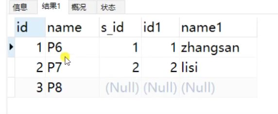
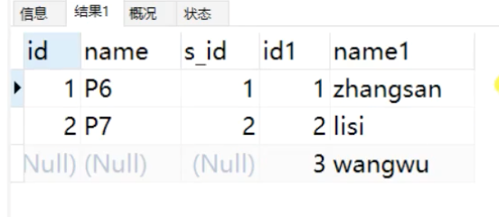
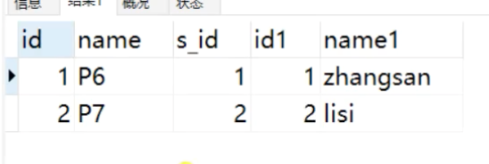

## 拓展（左连接、右连接、内连接）

### 左连接，左表为主（左表所有数据都显示，如果与右表中没有拼接，那么右表中的属性字段就是空）

> select a.* , b.* from a left join b on a.**b_id** = b.id



### 右连接同理 right join（右表为主，全部显示）

>  select a.* , b.* from a right join b on a.b_id = b.id



### 内连接 inner join（只显示有关联的）

>  select a.* , b.* from a inner join b on a.b_id = b.id




## 具体案例


一个角色（role）对应多个人（user），user中隐含一个role_id了，使用 left join … on …

**user表**

```xml
	<resultMap type="tech.pdai.springboot.mysql57.mybatis.xml.entity.User" id="UserResult">
		<id     property="id"       	column="id"      		/>
		<result property="userName"     column="user_name"    	/>
		<result property="password"     column="password"    	/>
		<result property="email"        column="email"        	/>
		<result property="phoneNumber"  column="phone_number"  	/>
		<result property="description"  column="description"  	/>
		<result property="createTime"   column="create_time"  	/>
		<result property="updateTime"   column="update_time"  	/>
		<collection property="roles" ofType="tech.pdai.springboot.mysql57.mybatis.xml.entity.Role">
			<result property="id" column="id"  />
			<result property="name" column="name"  />
			<result property="roleKey" column="role_key"  />
			<result property="description" column="description"  />
			<result property="createTime"   column="create_time"  	/>
			<result property="updateTime"   column="update_time"  	/>
		</collection>
	</resultMap>
	
	<sql id="selectUserSql">
        select u.id, u.password, u.user_name, u.email, u.phone_number, u.description, u.create_time, u.update_time, r.name, r.role_key, r.description, r.create_time, r.update_time
		from tb_user u
		left join tb_user_role ur on u.id=ur.user_id
		inner join tb_role r on ur.role_id=r.id
    </sql>
```


> ⚠️：其中使用到的是 left join 先拼接用户和角色的关联表，获取到了所有的用户
> 	然后再去拼接角色表，


**role表**

```xml
	<resultMap type="tech.pdai.springboot.mysql57.mybatis.xml.entity.Role" id="RoleResult">
		<id     property="id"       	column="id"      		/>
		<result property="name" 		column="name"  />
		<result property="roleKey" 		column="role_key"  />
		<result property="description" 	column="description"  />
		<result property="createTime"   column="create_time"  	/>
		<result property="updateTime"   column="update_time"  	/>
	</resultMap>
	
	<sql id="selectRoleSql">
        select  r.id, r.name, r.role_key, r.description, r.create_time, r.update_time
			from tb_role r
    </sql>
```

