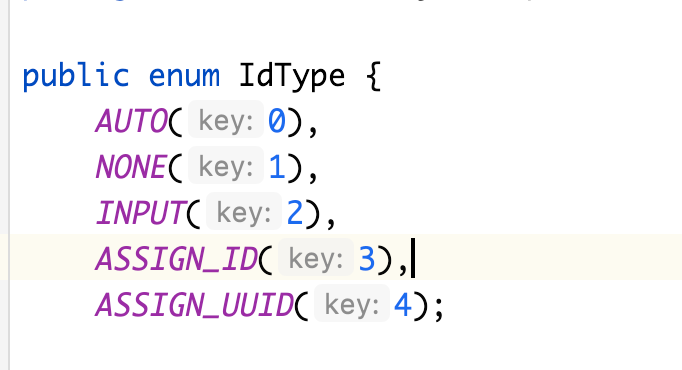

开发中使用Mybatis框架的时候遇到程序没有爆错，但是数据库没有办法插入数据的情况。仔细调试发现数据库中的id为null，所以猜测可能与id有关，去实体类中设置默认的id类型，自动填充。


## 实体类ID 自动填充


设置type属性，其中type参数有如下：




```
AUTO(0), 				默认自动增加
NONE(1),				空
INPUT(2),				手动传入id，不会自动生成
ASSIGN_ID(3),		使用雪花算法生成id
ASSIGN_UUID(4);		使用uuid生成id
```