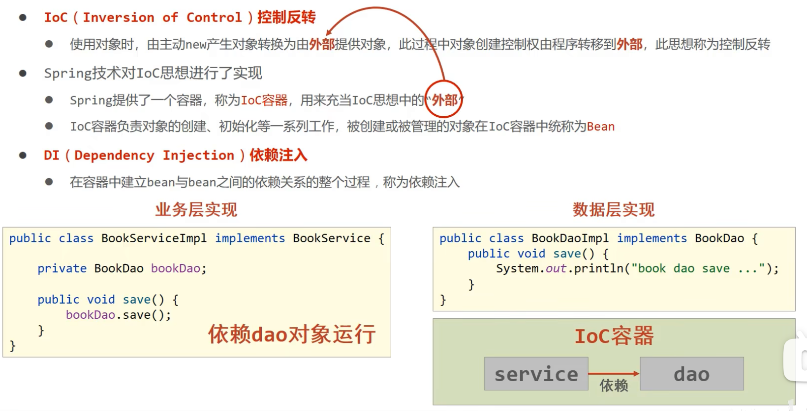

## ioc

​	从上图中可以看出，本来需要通过 new 生成对象 bookDao ，但是使用呢 ioc 之后就不需要了，统一由 ioc 容器管理所有的bean。这样的好处就是解耦，本来可能更改new 的对象，就得重新启动项目，但是有了这个就不需要通过代码展现出来，spring 的 ioc 自动帮我们处理了。

使用一些注解可以直接声明这个是一个 bean ，比如说： `@Controller` `@Component`

## DI

​	在 ioc 容器中已经处理好了 bean 之间的依赖关系，只需要声明了bean，那么就默认的从 ioc 中获取到对应的依赖关系，这个就是DI。

使用注解 `@Autowired` 或 `@Resource`来实现引入 bean 对象

### `@Autowired` 或 `@Resource`区别

@Autowired ：按类型装配，如果有两个相同的类型的 Mapper（继承同一个类型），那么会爆错，不知道加载哪一个。

@Resource：按名称装配，名称唯一，所以不会出错，使用时根据 @Mapper（name），name定义名称。