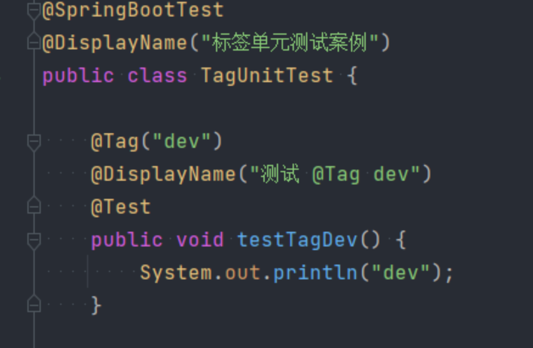

# 单元测试

## 引入xml


```xml
<dependency>
    <groupId>org.springframework.boot</groupId>
    <artifactId>spring-boot-starter-test</artifactId>
    <scope>test</scope>
</dependency>
```


## 测试文件

ide 添加测试文件快捷键 command + shift + T

@SpringBootTest 声明测试

